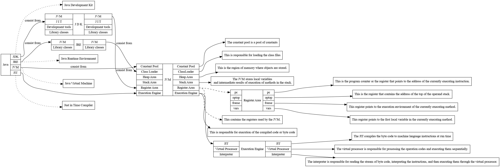

# DOT-diagramms
DOT diagrams of relates between JVM, JRE, JIT, JDK.

<h2>Result</h2>

<h2>DOT file to JPG on ARCH linux</h2>

    dot -Tpng example.dot -o example.png

<h2>Good links about graphviz</h2>
    
    https://wiki.archlinux.org/index.php/Graphviz
    https://www.tonyballantyne.com/graphs.html
    
    
<h2>JVM architecture</h2>

    https://www.developer.com/java/data/understanding-the-jvm-architecture.html

<h2>list of development tools for JDK</h2>

    https://docs.oracle.com/javase/7/docs/technotes/tools/
    
<h2>List of library classes</h2>

    https://docs.oracle.com/javase/8/docs/api/allclasses-frame.html

<h2>Online graphviz</h2>

    http://www.webgraphviz.com/
